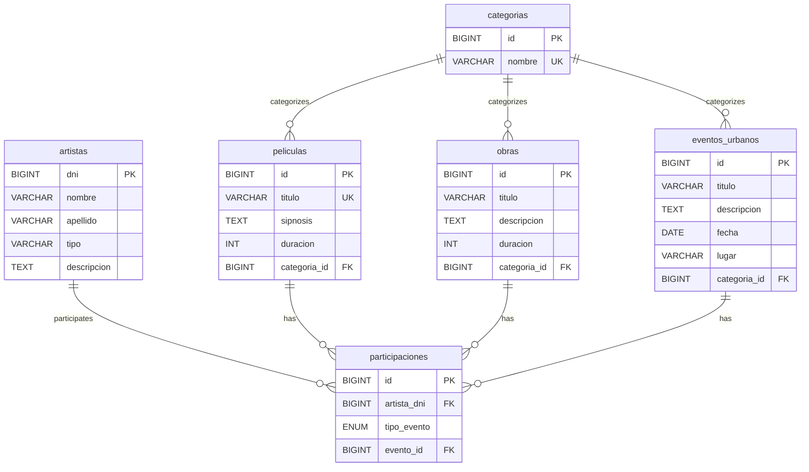

## Overview

Cinefinder uses a MySQL database named `CINES` with a relational schema designed to manage movies, theatrical works, urban events, artists, categories, and their relationships.

## Database Structure

The database consists of 6 main tables:

1. **categorias** - Content categories
2. **artistas** - Artist information
3. **peliculas** - Movie details
4. **obras** - Theatrical works
5. **eventos_urbanos** - Urban cultural events
6. **participaciones** - Artist participation in events

## Entity Relationship Diagram



## Table Schemas

### 1. categorias

Stores content categories for movies, works, and events.

```sql
CREATE TABLE IF NOT EXISTS CINES.categorias (
    id BIGINT PRIMARY KEY AUTO_INCREMENT,
    nombre VARCHAR(100) NOT NULL UNIQUE
);
```

**Columns:**

| Column | Type | Constraints | Description |
|--------|------|-------------|-------------|
| `id` | BIGINT | PRIMARY KEY, AUTO_INCREMENT | Unique category identifier |
| `nombre` | VARCHAR(100) | NOT NULL, UNIQUE | Category name |

**Example Data:**
- Acción (Action)
- Comedia (Comedy)
- Drama
- Terror (Horror)
- Ciencia Ficción (Science Fiction)
- Romance
- Documental (Documentary)
- Animación (Animation)
- Musical
- Thriller
- Fantasía (Fantasy)
- Aventura (Adventure)

**JPA Entity:** `Categorias` - src/main/java/com/trainee/Cinefinder/model/Categorias.java:12

---

### 2. artistas

Stores artist information including actors, singers, dancers, magicians, and other performers.

```sql
CREATE TABLE IF NOT EXISTS CINES.artistas (
    dni BIGINT PRIMARY KEY,
    nombre VARCHAR(70) NOT NULL,
    apellido VARCHAR(70) NULL,
    tipo VARCHAR(50),
    descripcion TEXT
);
```

**Columns:**

| Column | Type | Constraints | Description |
|--------|------|-------------|-------------|
| `dni` | BIGINT | PRIMARY KEY | National ID number (unique identifier) |
| `nombre` | VARCHAR(70) | NOT NULL | Artist first name |
| `apellido` | VARCHAR(70) | NULL | Artist last name (optional) |
| `tipo` | VARCHAR(50) | - | Artist type (Actor, Cantante, Bailarina, etc.) |
| `descripcion` | TEXT | - | Artist biography/description |

**Artist Types:**
- Actor / Actriz (Actor/Actress)
- Cantante (Singer)
- Bailarina (Dancer)
- Mago (Magician)
- Rapero (Rapper)
- Pintora (Painter)
- Músico (Musician)
- Performista (Performance Artist)

**JPA Entity:** `Artistas` - src/main/java/com/trainee/Cinefinder/model/Artistas.java:19

---

### 3. peliculas

Stores movie information.

```sql
CREATE TABLE IF NOT EXISTS CINES.peliculas (
    id BIGINT PRIMARY KEY AUTO_INCREMENT,
    titulo VARCHAR(200) UNIQUE NOT NULL,
    sipnosis TEXT,
    duracion INT NOT NULL,
    categoria_id BIGINT,
    CONSTRAINT categorias_fk_peliculas FOREIGN KEY (categoria_id) 
        REFERENCES categorias(id)
        ON DELETE CASCADE
        ON UPDATE CASCADE
);
```

**Columns:**

| Column | Type | Constraints | Description |
|--------|------|-------------|-------------|
| `id` | BIGINT | PRIMARY KEY, AUTO_INCREMENT | Unique movie identifier |
| `titulo` | VARCHAR(200) | UNIQUE, NOT NULL | Movie title |
| `sipnosis` | TEXT | - | Movie synopsis/summary |
| `duracion` | INT | NOT NULL | Duration in minutes |
| `categoria_id` | BIGINT | FOREIGN KEY → categorias(id) | Associated category |

**Foreign Key Constraints:**
- `categorias_fk_peliculas`: Links to `categorias(id)`
  - `ON DELETE CASCADE`: Deleting a category deletes associated movies
  - `ON UPDATE CASCADE`: Updating a category ID updates movie references

**Example Movies:**
- El Último Viaje (120 min, Ciencia Ficción)
- Amor de Barrio (95 min, Romance)
- Ríe que Ríe (100 min, Comedia)
- Bajo Tierra (110 min, Thriller)

**JPA Entity:** `Peliculas` - src/main/java/com/trainee/Cinefinder/model/Peliculas.java:13

---

### 4. obras

Stores theatrical works and stage performances.

```sql
CREATE TABLE IF NOT EXISTS CINES.obras (
    id BIGINT PRIMARY KEY AUTO_INCREMENT,
    titulo VARCHAR(200) NOT NULL,
    descripcion TEXT,
    duracion INT NOT NULL,
    categoria_id BIGINT,
    CONSTRAINT categorias_fk_obras FOREIGN KEY (categoria_id) 
        REFERENCES categorias(id)
        ON DELETE CASCADE
        ON UPDATE CASCADE
);
```

**Columns:**

| Column | Type | Constraints | Description |
|--------|------|-------------|-------------|
| `id` | BIGINT | PRIMARY KEY, AUTO_INCREMENT | Unique work identifier |
| `titulo` | VARCHAR(200) | NOT NULL | Work title |
| `descripcion` | TEXT | - | Work description |
| `duracion` | INT | NOT NULL | Duration in minutes |
| `categoria_id` | BIGINT | FOREIGN KEY → categorias(id) | Associated category |

**Foreign Key Constraints:**
- `categorias_fk_obras`: Links to `categorias(id)`
  - `ON DELETE CASCADE`
  - `ON UPDATE CASCADE`

**Example Works:**
- Voces Silenciadas (90 min, Drama)
- El Puente (95 min, Drama)
- Luz Roja (80 min, Musical)
- La Última Nota (100 min, Musical)

**JPA Entity:** `Obras` - src/main/java/com/trainee/Cinefinder/model/Obras.java:13

---

### 5. eventos_urbanos

Stores urban cultural events like street performances, festivals, and public art exhibitions.

```sql
CREATE TABLE IF NOT EXISTS CINES.eventos_urbanos (
    id BIGINT PRIMARY KEY AUTO_INCREMENT,
    titulo VARCHAR(200) NOT NULL,
    descripcion TEXT,
    fecha DATE NOT NULL,
    lugar VARCHAR(200) NOT NULL,
    categoria_id BIGINT,
    CONSTRAINT categoria_fk_eventos_urbanos FOREIGN KEY (categoria_id) 
        REFERENCES categorias(id)
        ON UPDATE CASCADE
        ON DELETE CASCADE
);
```

**Columns:**

| Column | Type | Constraints | Description |
|--------|------|-------------|-------------|
| `id` | BIGINT | PRIMARY KEY, AUTO_INCREMENT | Unique event identifier |
| `titulo` | VARCHAR(200) | NOT NULL | Event title |
| `descripcion` | TEXT | - | Event description |
| `fecha` | DATE | NOT NULL | Event date |
| `lugar` | VARCHAR(200) | NOT NULL | Event location |
| `categoria_id` | BIGINT | FOREIGN KEY → categorias(id) | Associated category |

**Foreign Key Constraints:**
- `categoria_fk_eventos_urbanos`: Links to `categorias(id)`
  - `ON DELETE CASCADE`
  - `ON UPDATE CASCADE`

**Example Events:**
- Festival de Callejeros (Plaza Bolívar, 2025-07-10)
- Noche de Freestyle (Parque de los Deseos, 2025-08-05)
- Arte al Paso (Calle 72, 2025-07-15)
- Mural Fest (Ciudad Salitre, 2025-07-12)

**JPA Entity:** `EventosUrbanos` - src/main/java/com/trainee/Cinefinder/model/EventosUrbanos.java:15

---

### 6. participaciones

Links artists to movies, works, or events they participate in. This is a polymorphic relationship table.

```sql
CREATE TABLE IF NOT EXISTS CINES.participaciones (
    id BIGINT PRIMARY KEY AUTO_INCREMENT,
    artista_dni BIGINT,
    tipo_evento ENUM('pelicula', 'obra', 'evento'),
    evento_id BIGINT,
    CONSTRAINT artista_participaciones FOREIGN KEY (artista_dni) 
        REFERENCES artistas(dni)
        ON DELETE CASCADE
);
```

**Columns:**

| Column | Type | Constraints | Description |
|--------|------|-------------|-------------|
| `id` | BIGINT | PRIMARY KEY, AUTO_INCREMENT | Unique participation identifier |
| `artista_dni` | BIGINT | FOREIGN KEY → artistas(dni) | Artist's DNI |
| `tipo_evento` | ENUM | 'pelicula', 'obra', 'evento' | Type of event |
| `evento_id` | BIGINT | - | ID of the event (references peliculas, obras, or eventos_urbanos) |

**Foreign Key Constraints:**
- `artista_participaciones`: Links to `artistas(dni)`
  - `ON DELETE CASCADE`: Deleting an artist removes their participations

**Note:** This table implements a polymorphic relationship where `evento_id` can reference:
- `peliculas.id` when `tipo_evento = 'pelicula'`
- `obras.id` when `tipo_evento = 'obra'`
- `eventos_urbanos.id` when `tipo_evento = 'evento'`

**Example Participations:**
- Artist DNI 69374820 in pelicula ID 1
- Artist DNI 71592047 in pelicula ID 2
- Artist DNI 71920384 in evento ID 1
- Artist DNI 74718290 in obra ID 3

**JPA Entity:** `Participaciones` - src/main/java/com/trainee/Cinefinder/model/Participaciones.java:16

---

## Relationships

### One-to-Many Relationships

#### categorias → peliculas
- **Type:** One-to-Many
- **Description:** One category can have many movies
- **Foreign Key:** `peliculas.categoria_id` → `categorias.id`
- **Cascade:** DELETE CASCADE, UPDATE CASCADE

#### categorias → obras
- **Type:** One-to-Many
- **Description:** One category can have many theatrical works
- **Foreign Key:** `obras.categoria_id` → `categorias.id`
- **Cascade:** DELETE CASCADE, UPDATE CASCADE

#### categorias → eventos_urbanos
- **Type:** One-to-Many
- **Description:** One category can have many urban events
- **Foreign Key:** `eventos_urbanos.categoria_id` → `categorias.id`
- **Cascade:** DELETE CASCADE, UPDATE CASCADE

#### artistas → participaciones
- **Type:** One-to-Many
- **Description:** One artist can participate in many events
- **Foreign Key:** `participaciones.artista_dni` → `artistas.dni`
- **Cascade:** DELETE CASCADE

### Polymorphic Relationships

#### participaciones → peliculas/obras/eventos_urbanos
- **Type:** Polymorphic Many-to-One
- **Description:** A participation can reference a movie, work, or urban event
- **Implementation:** 
  - `tipo_evento` ENUM determines the target table
  - `evento_id` stores the referenced ID
- **Target Tables:**
  - `tipo_evento = 'pelicula'` → `peliculas.id`
  - `tipo_evento = 'obra'` → `obras.id`
  - `tipo_evento = 'evento'` → `eventos_urbanos.id`

## Indexes

### Primary Keys (Automatically Indexed)
- `categorias.id`
- `artistas.dni`
- `peliculas.id`
- `obras.id`
- `eventos_urbanos.id`
- `participaciones.id`

### Unique Constraints (Automatically Indexed)
- `categorias.nombre`
- `peliculas.titulo`

### Foreign Key Indexes
MySQL automatically creates indexes on foreign key columns:
- `peliculas.categoria_id`
- `obras.categoria_id`
- `eventos_urbanos.categoria_id`
- `participaciones.artista_dni`

## Constraints Summary

### NOT NULL Constraints
- All primary keys
- `categorias.nombre`
- `artistas.nombre`
- `peliculas.titulo`, `peliculas.duracion`
- `obras.titulo`, `obras.duracion`
- `eventos_urbanos.titulo`, `eventos_urbanos.fecha`, `eventos_urbanos.lugar`

### UNIQUE Constraints
- `categorias.nombre` - Prevents duplicate category names
- `peliculas.titulo` - Prevents duplicate movie titles
- `artistas.dni` - Each artist has a unique national ID

### CASCADE Behaviors

**DELETE CASCADE:**
- Deleting a category deletes all associated movies, works, and events
- Deleting an artist deletes all their participations

**UPDATE CASCADE:**
- Updating a category ID updates all references in movies, works, and events

## Database Initialization

The database includes sample data for:
- 12 categories
- 12 artists
- 12 movies
- 12 theatrical works
- 12 urban events
- 12 artist participations

See the full SQL script at: `/workspace/source/BD_CINES.sql`

## JPA Mappings

The database schema is mapped to JPA entities using:

- `@Entity` - Marks the class as a JPA entity
- `@Table` - Specifies the table name
- `@Id` - Marks the primary key
- `@GeneratedValue` - Auto-increment strategy
- `@Column` - Maps to database columns
- `@ManyToOne` - Defines many-to-one relationships
- `@JoinColumn` - Specifies foreign key column

**Example:**

```java
@Entity
@Table(name = "peliculas")
public class Peliculas {
    @Id
    @GeneratedValue(strategy = GenerationType.IDENTITY)
    @Column(name = "id")
    private Integer id;
    
    @ManyToOne
    @JoinColumn(name = "categoria_id")
    private Categorias categorias_id;
}
```

## Best Practices

<CardGroup cols={2}>
  <Card title="Use Transactions" icon="rotate">
    Always use transactions when modifying multiple related records.
  </Card>
  <Card title="Validate Foreign Keys" icon="link">
    Ensure referenced IDs exist before creating relationships.
  </Card>
  <Card title="Handle Cascades" icon="triangle-exclamation">
    Be aware of cascade delete behaviors when removing categories or artists.
  </Card>
  <Card title="Index Performance" icon="gauge-high">
    The database is optimized with indexes on primary keys, unique columns, and foreign keys.
  </Card>
</CardGroup>

## Next Steps

<Card title="Architecture" icon="sitemap" href="/core-concepts/architecture">
  Learn about the Spring Boot architecture and design patterns
</Card>
